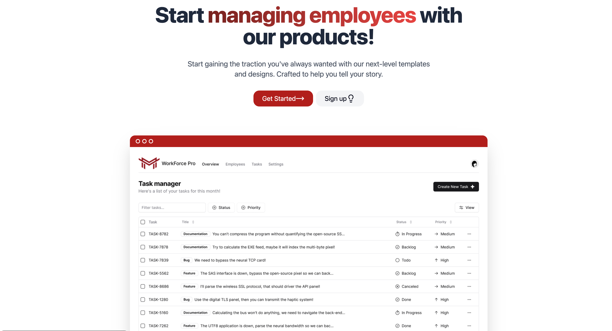
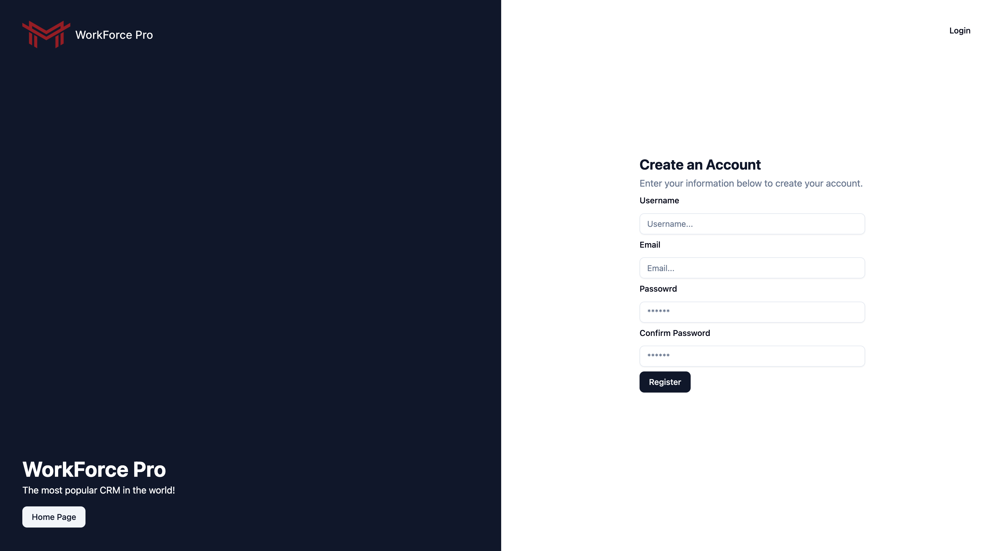
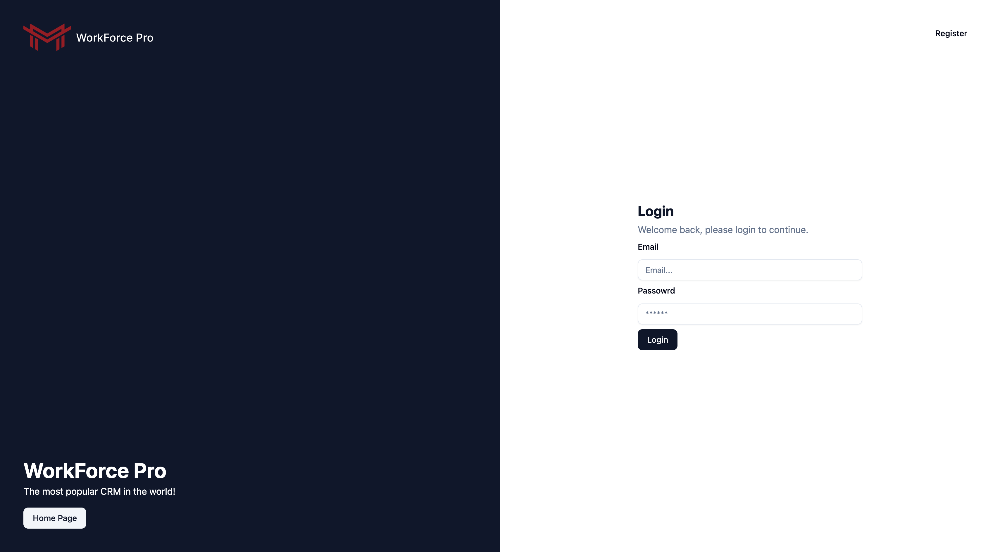
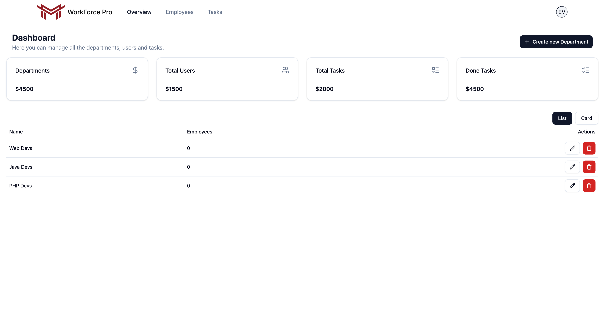
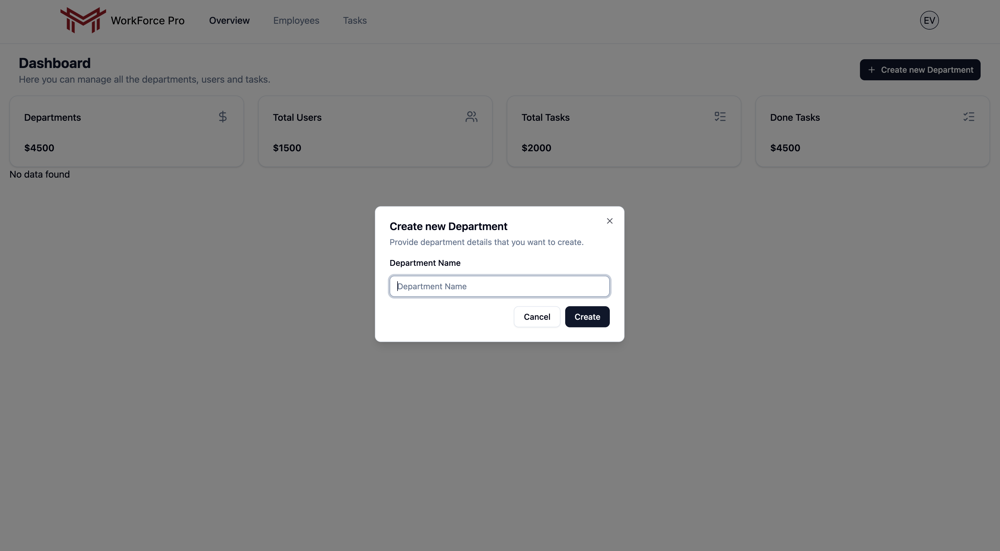
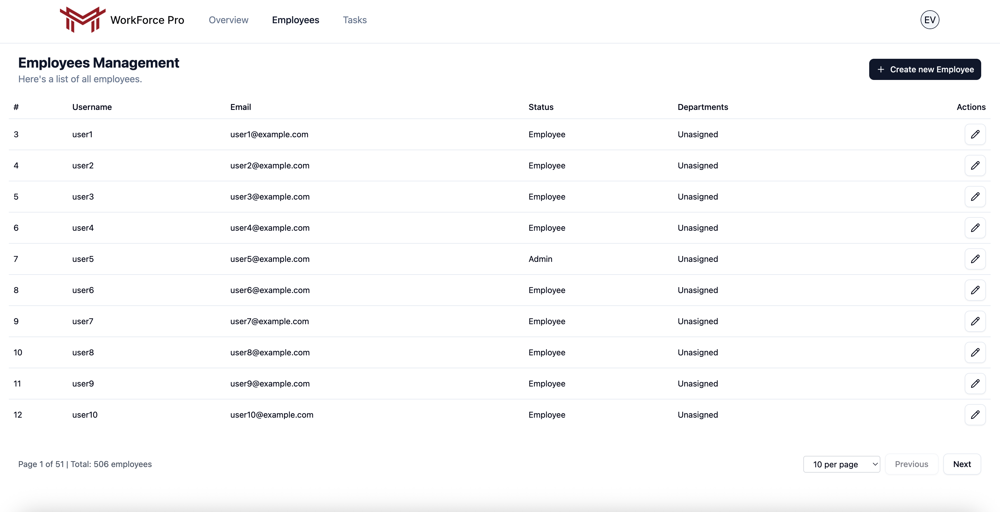
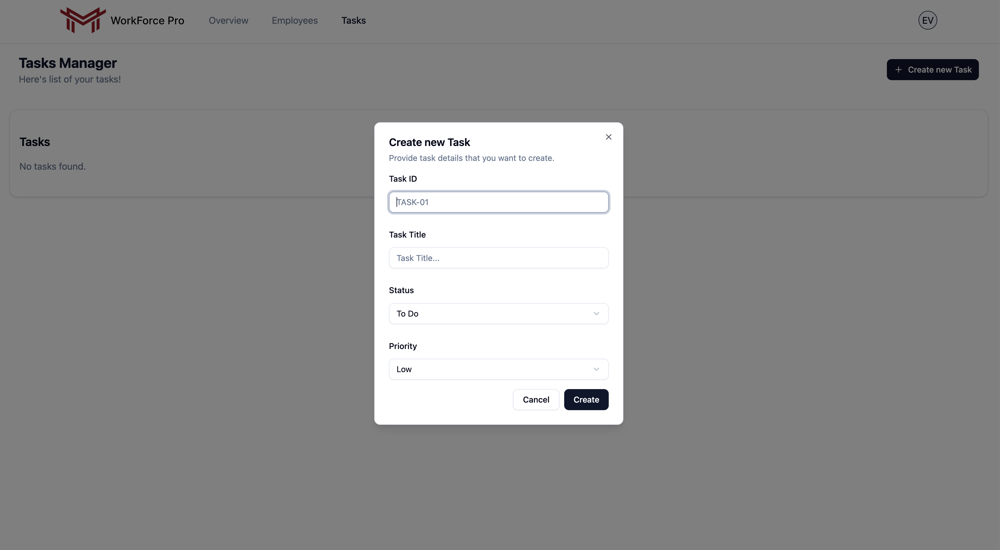

# WorkForce Pro

WorkForce Pro is a full-stack employee management platform for managing departments, employees, and tasks in one dashboard.

## Live Demo

- Live Demo: [workorce-pro.vercel.app](https://workorce-pro.vercel.app/)
- API: `http://localhost:8095`
- GitHub: [workorce-pro](https://github.com/enuridaveliu7/workorce-pro)

Note: the project is also available online through the Vercel deployment above.

## Features

- Authentication with login and register
- Dashboard overview for departments, employees, and tasks
- Department creation and deletion
- Employee listing with pagination
- Employee edit flow for status and department updates
- Employee delete action from the edit dialog
- Task creation, listing, and deletion
- Screenshot gallery for the full app flow

## Tech Stack

- Frontend: React, Vite, Redux Toolkit, Tailwind CSS, Radix UI
- Backend: Express.js, PostgreSQL
- Auth: JWT

## Project Structure

```text
WorkForce Pro/
├── employee-management-frontend/
├── employee-management-express/
├── employee-management-backend/
└── screenshots/
```

## Screenshots

### 1. Layout



### 2. Register



### 3. Login



### 4. Overview



### 5. Create Department



### 6. Employees



### 7. Create Tasks



## Getting Started

### 1. Install dependencies

```bash
npm install
cd employee-management-frontend && npm install
cd ../employee-management-express && npm install
cd ../employee-management-backend && npm install
```

### 2. Configure environment variables

Create the required `.env` files for the frontend and backend.

Example backend values:

```env
DOMAIN=http://localhost:5173
PORT=8095
DB_HOST=localhost
DB_PORT=5432
DB_USER=postgres
DB_PASSWORD=your_password
DB_NAME=employee-management-0925
JWT_SECRET=your_secret
```

Example frontend values:

```env
VITE_API_URL=http://localhost:8095
```

### 3. Run the project

From the root:

```bash
npm run dev
```

Or run services separately:

```bash
cd employee-management-frontend
npm run dev
```

```bash
cd employee-management-express
npm run dev
```

## Current Notes

- The app currently uses a local PostgreSQL database.
- The local app demo is intended for development and project presentation.
- The legacy `employee-management-backend` folder is still in the repo, but the active backend used in the current app flow is `employee-management-express`.

## Author

- Enuridaveliu7
